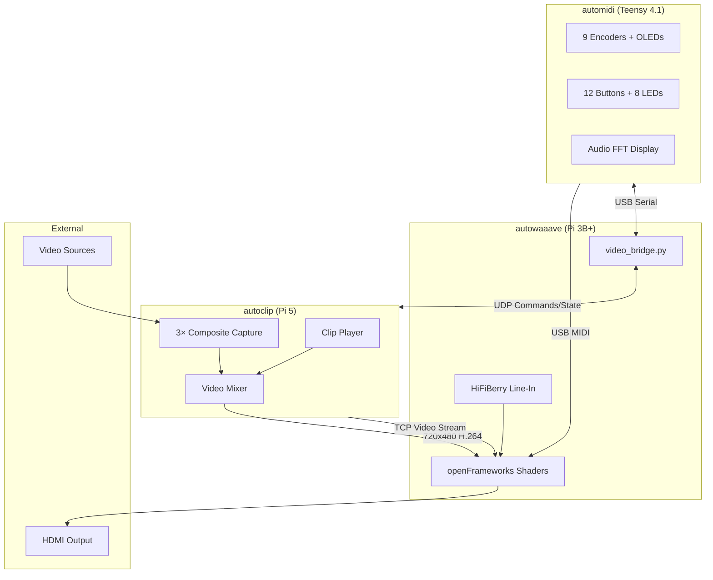

# autoeyez — Modular Video Synthesis System

A three-component real-time video synthesis and feedback system built around Raspberry Pi and Teensy hardware. Designed for live visual performance with hands-on control.

## System Overview

autoeyez combines hardware video mixing, GPU shader processing, and tactile MIDI control into a unified instrument for creating psychedelic video feedback effects, clip playback, and live composite video manipulation.



**Data Flow:**
- **MIDI CC** → Teensy sends shader parameters to autowaaave via USB MIDI
- **Commands** → Teensy sends clip/mixer commands through autowaaave's serial→UDP bridge to autoclip
- **State** → autoclip sends playback state through autowaaave's UDP→serial bridge back to Teensy OLEDs
- **Video** → autoclip streams composited video to autowaaave via TCP (port 1236)
- **Output** → autowaaave applies shader effects and outputs to HDMI

## Components

### automidi (Teensy 4.1)
Hardware MIDI controller with 9 rotary encoders, 9 OLED displays, 12 buttons, and 8 LEDs. Sends MIDI CC to autowaaave for shader control and serial commands to autoclip for clip/mixer control. Features audio-reactive FFT visualization, patch save/load, and multi-page parameter layouts.

### autowaaave (Raspberry Pi 3B+)
openFrameworks application running GPU fragment shaders for real-time video feedback processing. Receives video stream from autoclip, applies spatial transforms, color manipulation, luma keying, temporal filtering, and outputs to HDMI. Audio-reactive parameters modulated by FFT analysis of line input. **Based on [auto_waaave](https://github.com/ex-zee-ex/auto_waaave) by Andrei Jay.**

### autoclip (Raspberry Pi 5)
Video clip player and hardware mixer. Plays MP4 clips from SD card, captures 3 composite video sources via USB capture cards, composites them with crossfade and luma keying, and streams the result to autowaaave over TCP.

## Signal Flow

1. **Video Sources** → autoclip captures composite video + plays stored clips
2. **Compositing** → autoclip mixes sources with crossfade and luma key
3. **Streaming** → autoclip sends 720×480 H.264 stream to autowaaave via TCP (port 1236)
4. **Processing** → autowaaave applies GPU shader feedback effects
5. **Output** → autowaaave outputs processed video to HDMI
6. **Control** → automidi sends USB MIDI to autowaaave for shader parameters
7. **Bridging** → automidi sends serial commands through autowaaave to autoclip via UDP

## Features

- **GPU video feedback** with zoom, rotate, translate, hue shift
- **Luma keying** with adjustable threshold and source selection
- **Temporal filtering** with 60-frame delay buffer (2 seconds)
- **3 composite capture inputs** for external video sources
- **Clip playback** with loop, pause, and instant switching
- **9 parameter encoders** with visual feedback on OLEDs
- **32 video patches** + 32 audio-reactive patches (save/load)
- **Audio-reactive modulation** — FFT low/mid/high bands
- **Live performance ready** — boots to operational state

## Directory Structure

```
autoeyez/
├── README.md           # This file
├── BUILDME.md          # Hardware build overview
├── automidi/           # Teensy MIDI controller
│   ├── README.md
│   ├── BUILDME.md      # Detailed hardware build
│   └── auto_midi_v0911/
├── autoclip/           # Pi 5 clip player + mixer
│   ├── README.md
│   ├── BUILDME.md      # Capture cards, peripherals
│   └── *.py, *.service
├── autowaaave/         # Pi 3B+ shader processor
│   ├── README.md
│   ├── BUILDME.md      # Pi setup, HiFiBerry
│   └── *.cpp, *.py, *.service
└── deprecated/         # Old/unused code
```

## Quick Start

See `BUILDME.md` for full hardware assembly instructions.

1. Build the automidi controller (Teensy + encoders + displays)
2. Set up autoclip Pi 5 with capture cards
3. Set up autowaaave Pi 3B+ with HiFiBerry
4. Connect automidi to autowaaave via USB (provides both MIDI and serial)
5. Connect autowaaave to autoclip via direct ethernet (10.0.0.1 ↔ 10.0.0.2)
6. Power on all three — system auto-syncs on boot

**Note:** The Teensy has no direct connection to autoclip. All communication flows through autowaaave's video_bridge.py which translates serial↔UDP.

## License

MIT
